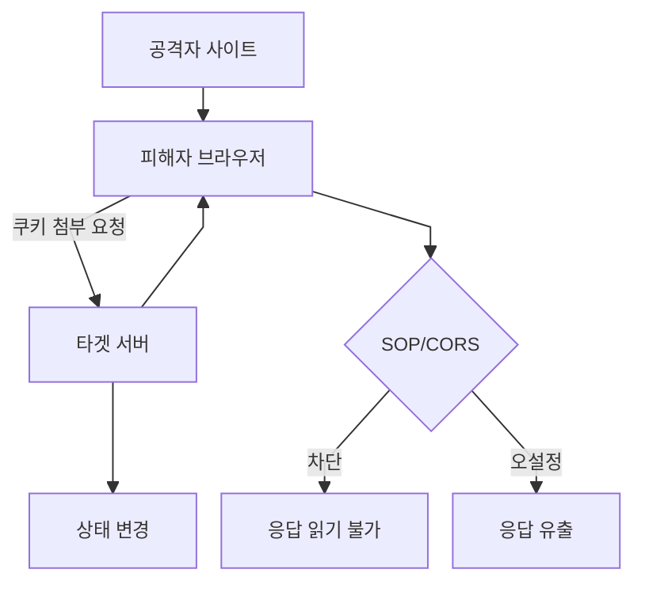
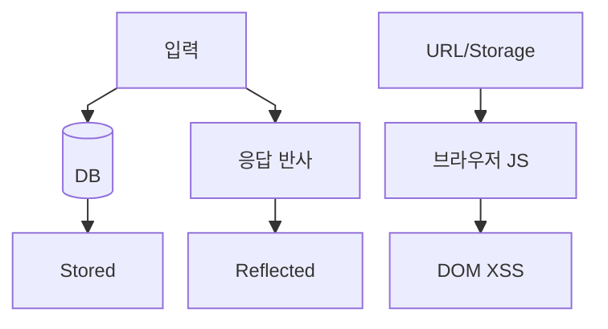

# 웹 보안 기본기 2 - SOP, CORS, XSS, CSRF

브라우저 보안은 "사용자의 브라우저가 어떤 출처의 스크립트를 믿고, 어떤 요청에 쿠키를 붙이며, 어떤 응답을 읽게 허용할 것인가"를 다룬다. SOP, CORS, XSS, CSRF는 서로 연결되어 있기 때문에 따로 외우기보다 관계를 이해하는 것이 중요하다.

## 1. 브라우저 보안 정책: SOP와 CORS

SOP(동일 출처 정책)와 CORS(교차 출처 리소스 공유)는 개발자들도 자주 헷갈리는 영역이다. 여기서 가장 중요한 개념은 **CORS는 서버 자체를 보호하는 정책이 아니라 브라우저가 교차 출처 응답을 읽어도 되는지 판단하는 정책**이라는 점이다.

- SOP(Same-Origin Policy): 악의적인 웹사이트가 브라우저에 로그인된 사용자의 권한을 이용해 타겟 사이트의 데이터를 읽어오지 못하게 막는 브라우저 보안 기능이다.
- CORS(Cross-Origin Resource Sharing): 서버가 응답 헤더를 통해 "이 출처의 JavaScript가 응답을 읽어도 된다"고 브라우저에게 알려주는 메커니즘이다.
- CORS 취약점: 요청 `Origin`을 그대로 반사하거나, 잘못된 allowlist/정규식으로 공격자의 도메인을 허용하고 `credentials`까지 허용하면 공격자가 피해자의 브라우저를 통해 민감한 API 응답을 읽을 수 있다.
- CSRF와의 차이: SOP/CORS는 주로 응답 읽기를 제어한다. CSRF는 응답을 읽지 못하더라도 쿠키가 자동 첨부되는 요청 자체를 악용해 상태 변경을 유도한다.

### SOP, CORS, CSRF 관계

## 2. XSS와 클라이언트 측 공격

XSS(Cross-Site Scripting)는 사용자 입력이 HTML/JavaScript 문맥에 안전하게 처리되지 않아 브라우저에서 공격자가 의도한 스크립트가 실행되는 취약점이다. 단순 쿠키 탈취뿐 아니라 사용자 권한으로 API 호출, 화면 변조, 피싱, CSRF 보조 공격으로 이어질 수 있다.

- Stored XSS: 게시글, 댓글, 프로필처럼 서버에 저장된 악성 입력이 다른 사용자에게 지속적으로 실행되는 유형이다.
- Reflected XSS: 검색어, 에러 메시지, URL 파라미터처럼 요청에 포함된 값이 응답에 즉시 반사될 때 발생하는 유형이다.
- DOM XSS: 서버 응답보다 브라우저의 JavaScript가 URL, hash, localStorage 등의 값을 DOM에 위험하게 삽입할 때 발생하는 유형이다.

HttpOnly 쿠키는 XSS 상황에서 쿠키 탈취를 어렵게 만든다. 하지만 HttpOnly가 있어도 XSS가 발생하면 공격자는 피해자 브라우저에서 인증된 API 요청을 수행할 수 있다. 따라서 HttpOnly는 피해를 줄이는 방어선이지 XSS 자체의 해결책은 아니다.

### XSS 유형별 발생 위치

## 3. XSS 방어 포인트

- 출력 위치에 맞게 HTML, attribute, JavaScript, URL context를 구분해 인코딩한다.
- 사용자 HTML을 허용해야 한다면 검증된 sanitizer를 사용한다.
- `innerHTML`, `document.write`, 문자열 기반 template 삽입 같은 위험한 DOM API 사용을 제한한다.
- CSP(Content Security Policy)를 적용해 inline script와 외부 script 출처를 제한한다.
- 쿠키에는 `HttpOnly`, `Secure`, `SameSite`를 적용해 탈취와 요청 위조의 영향을 줄인다.

## 4. CSRF와 쿠키 기반 요청 위조

CSRF(Cross-Site Request Forgery)는 사용자가 로그인된 상태에서 공격자가 만든 외부 페이지를 열었을 때, 브라우저가 인증 쿠키를 자동으로 첨부하는 특성을 악용해 상태 변경 요청을 보내게 만드는 공격이다.

- 핵심 조건: 쿠키 기반 인증, 예측 가능한 상태 변경 요청, 서버의 요청 출처 검증 부족이 결합될 때 위험해진다.
- SOP와의 차이: SOP는 응답 읽기를 막지만 요청 전송 자체를 항상 막지는 않는다. 그래서 SOP가 있어도 CSRF는 별도 방어가 필요하다.
- 주요 대상: 비밀번호 변경, 이메일 변경, 결제, 게시글 작성, 관리자 설정 변경처럼 상태가 바뀌는 기능이다.

## 5. CSRF 방어 포인트

- CSRF Token: 서버가 예측 불가능한 토큰을 발급하고, 상태 변경 요청마다 검증한다.
- SameSite 쿠키: `Lax` 또는 `Strict`를 적용해 교차 사이트 요청에서 쿠키 자동 첨부를 제한한다.
- Origin/Referer 검증: 상태 변경 요청의 출처를 확인한다.
- 중요한 작업의 재인증: 비밀번호 변경, 결제, 관리자 설정 변경에는 재인증이나 2차 확인을 요구한다.
- GET 요청으로 상태를 변경하지 않는다.

