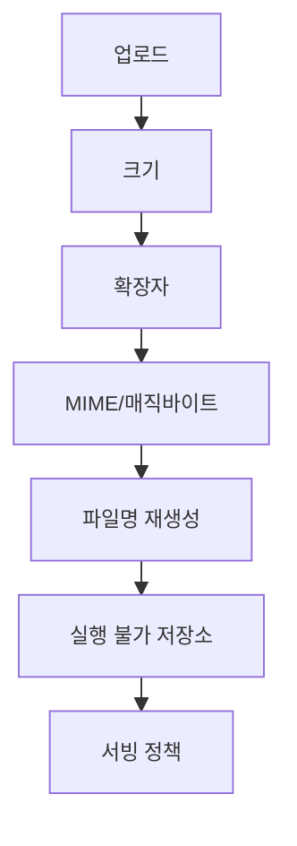
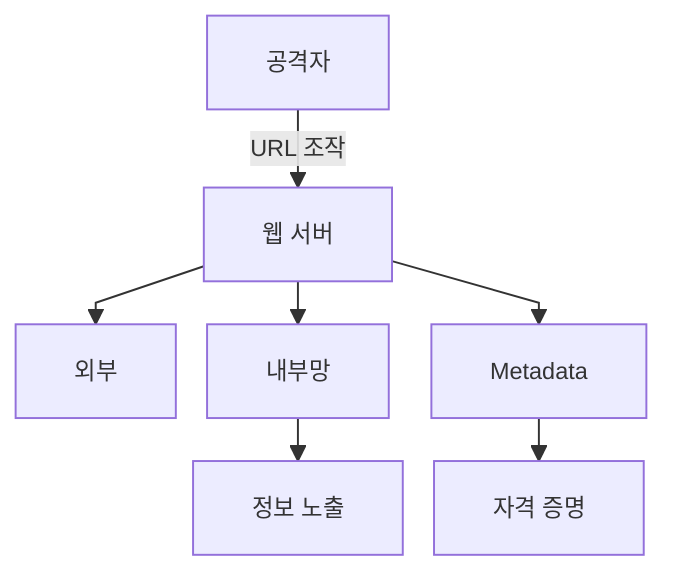
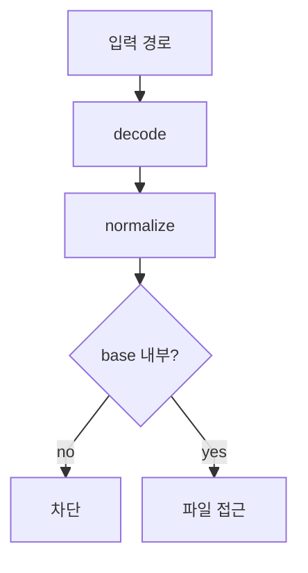
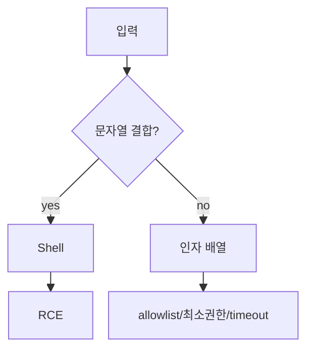

# 웹 보안 기본기 3 - 서버 측 취약점

서버 측 취약점은 데이터베이스, 파일 시스템, 내부망, OS 명령 실행처럼 애플리케이션 바깥의 자원과 연결될 때 자주 발생한다. 입력값이 단순 문자열처럼 보여도 서버 내부에서는 SQL, 파일 경로, URL, shell command, 객체로 해석될 수 있다.

## 1. SQL Injection과 파일 업로드

DB와 파일 시스템에 직접적인 타격을 주는 영역이다.

### SQL Injection

SQL Injection(SQLi)은 사용자 입력이 SQL 문맥에 안전하게 바인딩되지 않아 의도하지 않은 쿼리가 실행되는 취약점이다.

- 단순한 `' OR 1=1 --` 로그인 우회를 넘어 `UNION SELECT`를 이용해 다른 테이블 데이터를 조회할 수 있다.
- Error-Based 방식으로 DB 구조를 역산할 수 있다.
- ORM을 사용하더라도 Raw Query를 문자열 결합으로 작성하면 여전히 발생한다.
- 방어의 핵심은 파라미터 바인딩, ORM의 안전한 API 사용, DB 계정 최소 권한이다.

### 파일 업로드

파일 업로드는 가장 위험한 공격 중 하나인 RCE(Remote Code Execution)로 이어질 수 있다. 단, 업로드한 파일이 곧바로 RCE가 되는 것은 아니다. 업로드 경로가 실행 가능한 위치에 있거나 서버가 해당 파일을 실행하도록 설정되어 있을 때 위험해진다.

- 공격자는 이미지 업로드 기능에 `.php`, `.jsp`, `.py` 형태의 웹쉘을 업로드하려 시도할 수 있다.
- 확장자만 검사하면 우회될 수 있다.
- MIME type은 클라이언트가 조작할 수 있으므로 단독 신뢰하면 안 된다.
- 파일명은 서버에서 재생성하고, 저장 경로는 웹 실행 경로와 분리해야 한다.
- 가능하면 object storage나 정적 파일 서버를 분리하고, 업로드 디렉토리에는 실행 권한을 제거한다.

### 파일 업로드 방어 흐름

## 2. SSRF와 서버 측 요청 악용

SSRF(Server-Side Request Forgery)는 서버가 외부 URL을 대신 요청하는 기능에서 공격자가 요청 대상을 조작하여 내부망이나 민감한 내부 서비스에 접근하게 만드는 취약점이다.

- 자주 발생하는 기능: URL 미리보기, 이미지 다운로드, webhook, PDF 생성, 파일 import, 외부 API 연동
- 주요 위험: 내부 관리자 페이지 접근, 클라우드 metadata endpoint 접근, 내부 포트 스캔, 사설망 서비스 호출
- 우회 포인트: URL parser 차이, redirect, DNS rebinding, IP 표기 변형, allowlist 검증 미흡
- 방어 포인트: 서버 측 allowlist, 사설 IP/metadata endpoint 차단, redirect 제한, DNS 재검증, egress firewall 적용

### SSRF 네트워크 경계

## 3. Path Traversal과 임의 파일 접근

Path Traversal은 파일명이나 경로를 입력받는 기능에서 상위 디렉토리 이동 문자를 이용해 의도하지 않은 파일에 접근하는 취약점이다. 파일 다운로드, 이미지 조회, 로그 조회, 압축 해제 기능에서 자주 발생한다.

- 주요 위험: 설정 파일, 소스코드, 로그, 사용자 업로드 파일, 시스템 파일 노출
- 우회 포인트: URL encoding, 이중 encoding, Windows/Linux 경로 구분자 차이, 심볼릭 링크, zip slip
- 방어 포인트: 사용자 입력을 직접 파일 경로로 사용하지 않고 파일 ID 매핑 방식을 사용한다. 경로 정규화 후 허용 디렉토리 내부인지 검증한다. 압축 해제 시 대상 경로 검증도 필요하다.

### Path Traversal 방어 흐름

## 4. Command Injection과 RCE

Command Injection은 사용자 입력이 OS 명령어 문자열에 섞이면서 의도하지 않은 명령이 실행되는 취약점이다. 성공하면 RCE(Remote Code Execution)로 이어질 수 있어 영향도가 매우 크다.

- 자주 발생하는 기능: ping/traceroute, 이미지·영상 변환, 압축/백업, 배포 스크립트, 문서 변환, 외부 도구 실행
- 위험한 패턴: `shell=True`, 문자열 결합으로 명령어 생성, 입력값을 옵션이나 파일명으로 직접 전달하는 구조
- 방어 포인트: shell 호출을 피하고 인자 배열 기반 API를 사용한다. 허용 목록 기반 입력 검증, 실행 계정 최소 권한, 컨테이너/샌드박스 격리, timeout과 리소스 제한도 필요하다.

### Command Injection 위험 지점

## 5. 역직렬화 취약점

역직렬화 취약점은 신뢰할 수 없는 데이터를 객체로 복원하는 과정에서 코드 실행, 권한 우회, 객체 상태 조작이 발생하는 문제다. 단순 데이터 포맷처럼 보여도 런타임에 객체 생성 로직이 실행될 수 있다.

- 주요 예시: Python `pickle`, Java serialization, PHP object injection, unsafe YAML load, 일부 템플릿/메시지 큐 객체 복원 구조
- 주요 위험: RCE, 인증 우회, 권한 상승, 애플리케이션 내부 상태 변조
- 방어 포인트: 신뢰할 수 없는 입력은 위험한 역직렬화 포맷으로 처리하지 않는다. JSON처럼 단순 데이터 포맷을 사용하고, 타입 allowlist, 서명 검증, 라이브러리의 safe mode를 사용한다.

