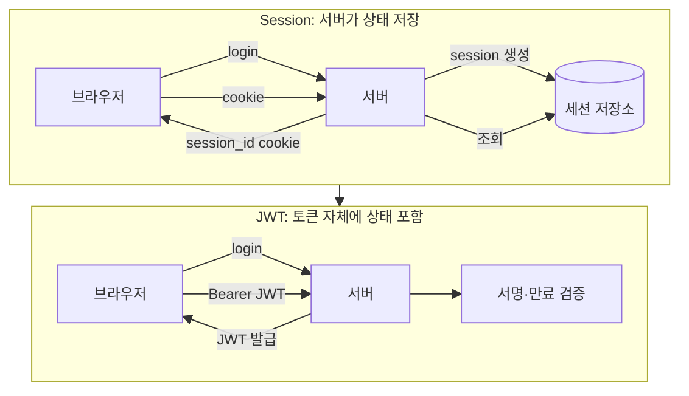
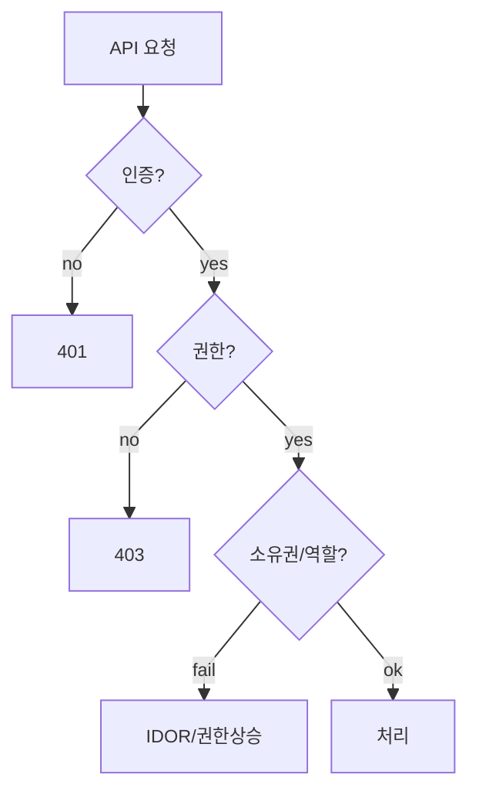

# 웹 보안 기본기 1 - HTTP, 인증, 인가

웹 보안은 결국 사용자가 보낸 요청을 서버가 어떻게 해석하고, 누가 어떤 리소스에 접근할 수 있는지 판단하는 문제에서 시작된다. HTTP 요청과 응답, 인증 상태, 인가 검증이 흔들리면 대부분의 웹 취약점이 그 지점에서 발생한다.

## 1. HTTP 통신과 API 공격 표면

HTTP Request/Response, Method, Header는 모든 웹 공격의 진입점이다. 웹 프록시 도구(Burp Suite 등)를 사용하면 브라우저와 서버 사이의 HTTP 요청/응답을 관찰하고 변조할 수 있다. HTTPS 환경에서도 Burp CA 인증서를 브라우저에 설치하면 프록시가 복호화된 요청을 보여주기 때문에, 실제 서비스가 어떤 API를 호출하는지 확인할 수 있다.

- RESTful API 변조 (Method/Parameter): 공격자는 프론트엔드에서 비활성화된 버튼을 무시하고 API 엔드포인트로 직접 `PUT`, `PATCH`, `DELETE` 요청을 보낼 수 있다. 이때 파라미터를 조작해 타인의 데이터를 수정할 수 있으면 IDOR(Insecure Direct Object Reference) 취약점으로 이어진다.
- Header 조작: `Host` 헤더를 조작해 캐시 포이즈닝을 유발하거나, `X-Forwarded-For`를 변조해 IP 기반 접근 제어를 우회할 수 있다. 서버가 클라이언트가 보낸 헤더를 무조건 신뢰할 때 문제가 발생한다.
- API 직접 호출: UI에서 숨겨진 기능이라도 API가 서버 측 권한 검증 없이 실행되면 공격자는 브라우저 개발자 도구나 프록시로 직접 호출할 수 있다.

## 2. 상태 관리와 인증 체계

인증 체계는 크게 Stateful(Session)과 Stateless(JWT)로 나뉜다. 두 방식은 상태를 어디에 보관하는지가 다르고, 그에 따라 공격 표면도 달라진다.

| 인증 방식 | 핵심 구조 | 주요 공격 벡터 |
|---|---|---|
| Cookie / Session | 서버의 메모리나 DB에 세션 상태를 저장한다. 클라이언트는 세션 ID만 쿠키로 보관한다. | 세션 고정, 세션 하이재킹, 세션 저장소 탈취, 쿠키 속성 오설정 |
| JWT / Token | 클라이언트가 서명된 상태를 토큰 형태로 보관한다. 서버는 서명과 만료시간을 검증한다. | 서명 검증 우회, 약한 secret, `aud`/`iss`/`exp` 검증 누락, 탈취 후 폐기 어려움 |

### Session과 JWT 구조 비교

### 세션 기반 인증의 주요 위험

- 세션 고정(Session Fixation): 공격자가 미리 알고 있는 세션 ID를 피해자에게 사용하게 만든 뒤, 피해자가 로그인하면 같은 세션 ID로 인증 상태를 탈취하는 방식이다.
- 세션 하이재킹(Session Hijacking): XSS, 네트워크 탈취, 로그 노출 등으로 세션 ID가 유출되면 공격자가 피해자처럼 요청을 보낼 수 있다.
- 쿠키 보안 속성 누락: `HttpOnly`, `Secure`, `SameSite`가 적절히 설정되지 않으면 XSS나 CSRF의 영향이 커진다.

### JWT 기반 인증의 주요 위험

- 서명 검증 우회: 과거에는 JWT 헤더의 `alg`를 `none`으로 바꿔 서명 검증을 우회하는 사례가 있었다. 요즘 라이브러리는 대부분 방어하지만, 알고리즘 고정과 검증 로직 확인은 여전히 필요하다.
- 약한 secret: HMAC 기반 JWT에서 secret이 짧거나 예측 가능하면 brute force로 서명을 위조할 수 있다.
- 클레임 검증 누락: `exp`, `nbf`, `aud`, `iss`를 검증하지 않으면 만료된 토큰이나 다른 서비스용 토큰이 받아들여질 수 있다.
- 폐기 어려움: Stateless 특성상 이미 발급된 토큰은 만료 전까지 유효할 수 있다. 블랙리스트, 토큰 버전, 짧은 access token 만료, refresh token rotation 같은 전략이 필요하다.

## 3. 인증과 인가 취약점

인증(Authentication)은 사용자가 누구인지 확인하는 과정이고, 인가(Authorization)는 인증된 사용자가 특정 리소스나 기능에 접근할 권한이 있는지 확인하는 과정이다. 로그인 여부만 확인하고 리소스 소유자나 역할을 검증하지 않으면 인가 취약점으로 이어진다.

- IDOR(Insecure Direct Object Reference): 요청 파라미터의 사용자 ID, 문서 ID, 주문 ID 등을 조작했을 때 다른 사용자의 데이터에 접근 가능한 취약점이다.
- 수평 권한 상승: 일반 사용자가 같은 권한 수준의 다른 사용자 리소스에 접근하는 문제다.
- 수직 권한 상승: 일반 사용자가 관리자 기능이나 상위 권한 기능에 접근하는 문제다.
- 기능 단위 접근 제어 누락: UI에서는 버튼이 숨겨져 있지만 API endpoint를 직접 호출하면 기능이 실행되는 문제다.
- Mass Assignment: 클라이언트가 보낸 JSON 필드를 서버가 그대로 모델에 매핑하여 `role`, `isAdmin`, `balance` 같은 민감 필드가 변경되는 문제다.

### 인증과 인가 흐름

## 방어 포인트

- 클라이언트 UI를 신뢰하지 말고 서버에서 매 요청마다 권한을 검증한다.
- 리소스 ID가 들어오는 모든 API에서 소유권 검증을 수행한다.
- 관리자 기능은 URL, method, body뿐 아니라 서버 측 role check로 보호한다.
- 클라이언트가 변경 가능한 필드를 명시적으로 allowlist 처리한다.
- 인증 토큰의 만료, 발급자, 대상, 서명을 모두 검증한다.

